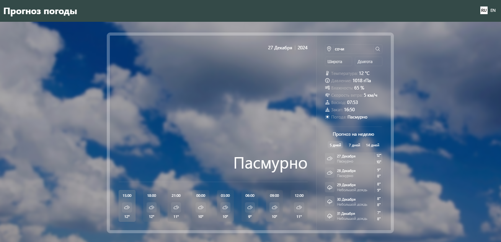

# Weather_app_React_API

 

### With:
:heavy_check_mark: HTML  
:heavy_check_mark: SCSS  
:heavy_check_mark: REACT  
:heavy_check_mark: Vite  

### Without:
:x: Frameworks 
:x: Pixel-Perfect 
:x: Responsive-Design 

#### Original layout: *[Dribble](https://dribbble.com/shots/21260336-Weather-App-UI-UX-Design)*
